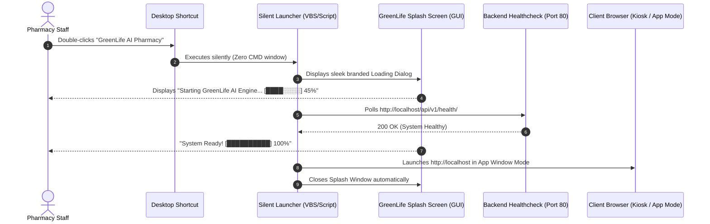

# GreenLife AI — Enterprise Desktop Experience & Security Architecture

**Document Version:** 2.5 (September 2026)  
**System Target:** Production Windows 10/11 Client Workstations  
**Objective:** Provide a seamless, enterprise-grade desktop launcher experience where dispensary staff never see terminal windows, code, or Docker commands, while strictly protecting client data, folder structure, and access credentials.

---

## 1. Executive Summary & Goals

| Objective | Problem Solved | Target User Experience |
| :--- | :--- | :--- |
| **Silent Boot Auto-Start** | Users had to remember to run scripts or start Docker manually. | PC boots up $\rightarrow$ Docker & GreenLife containers silently start in the background. Ready before the staff even sits down. |
| **Folder Protection & Hiding** | The app folder sits on Desktop (`... - Copy`), risking accidental file deletion, renaming, or volume loss. | Application directory moved to `C:\GreenLife` (or hidden). Desktop is 100% clean with only **one official icon**. |
| **Zero-Terminal Desktop Launcher** | Opening the system opened black CMD prompts with code, confusing pharmacy staff. | Double-clicking the Desktop icon displays a sleek **GreenLife Splash Screen** with a branded loading bar. No CMD windows ever appear. |
| **Strict Login Screen Enforcement** | Previously, the browser auto-restored saved Super Admin sessions, bypassing sign-in. | Every launch strictly lands on the **Login Page**. Cashiers, Pharmacists, and Managers must enter their own credentials. |
| **Admin-Only Technical Telemetry** | Technical Docker logs were exposed to everyone or required opening terminal windows. | Regular staff see only the clean UI. Super Admin accesses technical Docker logs directly inside the app control suite. |

---

## 2. Component 1: Automatic Silent Background Startup on PC Boot

### How It Works Under the Hood
1. **Docker Desktop System Startup**:
   - In Docker Desktop $\rightarrow$ **Settings (Gear Icon)** $\rightarrow$ **General**:
     - Check: **`Start Docker Desktop when you sign in`**
     - Check: **`Open Docker Desktop in the background`** (minimized to system tray)
2. **Container Auto-Resurrection (`restart: unless-stopped`)**:
   - In [`docker-compose.yml`](docker-compose.yml), all 4 core services are declared with:
     ```yaml
     restart: unless-stopped
     ```
   - When Windows starts up and Docker Desktop initializes, Docker **automatically restarts all 4 containers** in the background:
     - `greenlifeai_postgres` (Port 5434)
     - `greenlifeai_redis` (Port 6380)
     - `greenlifeai_backend` (Port 8000)
     - `greenlifeai_frontend` (Port 80)
3. **Outcome**: The dispensary system is completely initialized and listening on `http://localhost` before the user opens any browser or clicks the desktop icon.

---

## 3. Component 2: Folder Relocation & Local Disk Protection

### The Danger of Desktop Folders
Keeping `GreenLifeAi_Pharmacy_Management_System - Copy` on the desktop creates major hazards:
- Users might drag it into the Recycle Bin.
- Users might rename it, breaking path references.
- Users can inspect source code, environment variables, or database dumps.

### Standard Enterprise Directory Structure
1. Move the production folder from the desktop to the root drive:
   ```text
   C:\GreenLife\
   ```
2. **Optional Folder Hiding**:
   - You can mark the folder as hidden so standard file explorer browsing ignores it:
     ```cmd
     attrib +h "C:\GreenLife"
     ```
3. **What Remains on the User's Desktop**:
   - Exactly **one single shortcut**:
     - **Name:** `GreenLife AI Pharmacy`
     - **Icon:** `C:\GreenLife\assets\greenlife.ico` (official medical cross branding)
     - **Target:** `C:\GreenLife\Launch-GreenLife.vbs` (Silent launcher)

---

## 4. Component 3: Silent Launcher & Branded Splash Screen

### The Architecture
Instead of double-clicking `Start-GreenLife.bat` (which pops up a black CMD console), the Desktop shortcut points to a lightweight, invisible launcher (`Launch-GreenLife.vbs`) that displays a beautiful, modern splash window.



### Splash Screen Specifications
- **Window:** Centered, frameless or modern styled window (500x320 px).
- **Background:** Deep slate `#020617` with emerald/brand glow `#059669`.
- **Branding:** GreenLife AI Dispensary Suite logo, version number.
- **Dynamic Status Messages:**
  1. *"Initializing dispensary engine..."*
  2. *"Verifying local database connection..."*
  3. *"Synchronizing inventory cache..."*
  4. *"Welcome! Opening GreenLife AI..."*
- **Kiosk / App Window Launch Mode**:
  - Launches Chrome or Edge using `--app=http://localhost`.
  - This hides browser URL bars, back buttons, and bookmark tabs, making GreenLife look and feel like an expensive, standalone Windows desktop application.

---

## 5. Component 4: Strict Authentication & Login Page Enforcement

### The Root Cause of the Auto-Login Issue
Previously, when the Super Admin (`Admink19`) signed in, the authentication handler stored the session in browser `localStorage`:
```ts
localStorage.setItem('greenlife_auth_session', JSON.stringify({ userId: mappedUser.id, ... }));
```
When the app was launched next time, `PharmacyContext.tsx` checked `localStorage` on initial mount:
```ts
const [isAuthenticated, setIsAuthenticated] = useState<boolean>(() => {
  return !!localStorage.getItem('greenlife_auth_session');
});
```
Because the Super Admin's token was cached, the system bypassed the login screen and went straight to the Super Admin dashboard.

### The Security Solution
To enforce strict accountability for sales, stock dispensing, and financial auditing:
1. **Switch to Session Storage (`sessionStorage`)**:
   - Authentication tokens are held in `sessionStorage` rather than persistent `localStorage`.
   - When the browser or app window is closed, the session token is **automatically destroyed**.
2. **Forced Landing on Login Screen**:
   - Opening the desktop application **always lands on the Login Page**.
   - Cashiers, Pharmacists, Store Managers, and Admins must enter their personal credentials:
     - Cashier signs in $\rightarrow$ Lands on POS Cashier Dashboard.
     - Pharmacist signs in $\rightarrow$ Lands on Clinical & Dispensing Dashboard.
     - Super Admin signs in $\rightarrow$ Lands on Full Control Suite.
3. **No Default Auto-Filling of Super Admin**:
   - The login fields remain clean and empty.
   - Demo quick-fill buttons are disabled in `PRODUCTION` mode so staff cannot click into unauthorized accounts.

---

## 6. Component 5: Super Admin Technical Logs & Telemetry

Staff members never need to see Docker containers, port numbers, or error stacks. However, the Super Admin must still have full technical visibility when needed:

1. **Inside the App (In-Browser Super Admin Suite)**:
   - Navigate to: **System Settings & Super Admin Control Suite** $\rightarrow$ **Technical Telemetry**.
   - Live view of:
     - PostgreSQL database status & storage footprint.
     - Redis memory usage.
     - Docker container uptime.
     - Real-time application logs.
2. **Offline Admin Console Utility (`Admin-Console.bat`)**:
   - Kept in `C:\GreenLife\tools\Admin-Console.bat`.
   - Accessible only by administrators if the web interface cannot be reached.
   - Allows taking instant database snapshots, viewing container status, or reviewing logs without affecting client records.

---

## 7. Rollout & Maintenance Summary

| Step | Action |
| :--- | :--- |
| **1. Update Auth** | Apply session-based login in `PharmacyContext.tsx` so users always see the login screen. |
| **2. Deploy Folder** | Place the project cleanly at `C:\GreenLife`. |
| **3. Setup Launcher** | Install `Launch-GreenLife.vbs` and create the Desktop shortcut `GreenLife AI Pharmacy`. |
| **4. Configure Docker** | Enable "Start on sign in" and "Start minimized" in Docker Desktop settings. |
| **5. Test** | Reboot the client PC $\rightarrow$ Confirm Docker boots silently $\rightarrow$ Double click the desktop icon $\rightarrow$ Verify splash screen $\rightarrow$ Verify clean Login Page appears. |
