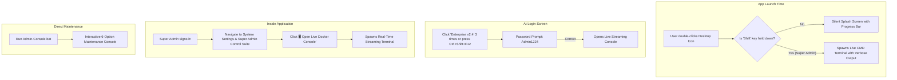

# GreenLife AI — Super Admin Live Console & Telemetry Access Architecture

**Document Version:** 1.0 (September 2026)  
**System Target:** GreenLife AI Pharmacy Management System  
**Objective:** Provide the Super Admin with instant, on-demand access to live Command Prompt windows, real-time Docker container telemetry, streaming logs, and interactive diagnostics, while maintaining a completely silent, zero-terminal experience for everyday pharmacy staff.

---

## 1. Design Philosophy: Silent for Staff, Full Telemetry for Admin

| User Type | Experience | Visibility |
| :--- | :--- | :--- |
| **Cashiers & Pharmacists** | Double-click desktop icon $\rightarrow$ Branded splash loading bar $\rightarrow$ Clean Login Screen. | **Zero** CMD windows, zero code, zero Docker error messages. |
| **Super Admin** | On-demand trigger (Startup Hotkey, Login Easter Egg, In-App Button, or Admin Utility). | **Full live CMD prompt**, real-time log stream (`docker compose logs -f`), container status, and database shells. |

---

## 2. The 4 On-Demand Access Mechanisms



---

## 3. Detailed Mechanism Specifications

### Method 1: The "Hold Shift" Startup Bypass (Pre-Boot Telemetry)
* **When to Use**: When launching the system and you want to watch the Docker engine boot up, containers start, or diagnose why a service is slow.
* **How It Works**:
  1. Regular launch: Double-click **GreenLife AI Pharmacy** desktop shortcut $\rightarrow$ Launches `Launch-GreenLife.vbs` $\rightarrow$ Displays silent animated splash screen.
  2. Super Admin launch: **Hold down the `Shift` key** while double-clicking the shortcut (or press `Ctrl + Alt + D` while the splash screen is loading).
  3. The launcher detects the key modifier, suppresses the splash screen, and **launches the active Command Prompt window** directly on screen showing:
     - Docker Desktop process check.
     - Container health states (`docker compose ps`).
     - Real-time backend startup logs.
     - Automated database snapshot confirmation.

---

### Method 2: Secret Click on the Login Screen (Easter Egg Trigger)
* **When to Use**: When the app is already open at the login screen and you need to inspect Docker without closing or restarting the browser.
* **How It Works**:
  1. On the top navigation bar of the Login Screen, locate the **"Enterprise v2.4"** badge or the **"G+"** logo.
  2. Click the badge **3 times consecutively** (or press keyboard shortcut `Ctrl + Shift + F12`).
  3. A secure administrative modal appears:
     ```text
     =============================================
             SUPER ADMIN TERMINAL ACCESS
     =============================================
     Enter Super Admin Password: [ •••••••••••• ]
     
     [ Open Live Docker Terminal ]      [ Cancel ]
     =============================================
     ```
  4. Entering the Super Admin credential (`Admin1224`) triggers the local background helper to spawn a live CMD window attached to `docker compose logs -f`.

---

### Method 3: In-App One-Click Action (Super Admin Control Suite)
* **When to Use**: During regular daily operations when the Super Admin is signed in and reviewing system performance.
* **Location in UI**:
  - Open **System Settings & Super Admin Control Suite**.
  - Navigate to the **Technical Telemetry & Infrastructure** tab.
* **UI Controls**:
  - **`[ 🖥️ Launch Live Docker Console ]`**: Opens a live CMD window running container process monitors.
  - **`[ 📋 Stream Real-Time Logs ]`**: Opens a live console running `docker compose logs -f --tail=100` (shows backend API calls, database queries, and Redis events as they happen).
  - **`[ 💾 Take Instant Live Backup ]`**: Runs a live `pg_dump` snapshot directly into the `backups/` directory without stopping services.

---

### Method 4: Dedicated Standalone Admin Console (`Admin-Console.bat`)
* **When to Use**: Deep troubleshooting, offline server maintenance, or manual database inspection when the browser is closed.
* **Location**: Located in `C:\GreenLife\Admin-Console.bat` (or placed in a private `Admin Tools` desktop folder).
* **Interactive Menu**:
  ```text
  ================================================================================
             GREENLIFE AI PHARMACY MANAGEMENT SYSTEM
                    Super Admin Operations Console
  ================================================================================
   Current Directory: C:\GreenLife\
   System Status:     Operational (4/4 Containers Online)
  ================================================================================

   [1] View Container Status          (docker compose ps)
   [2] Stream Live Unified Logs       (docker compose logs -f --tail=100)
   [3] Stream Backend API Logs Only   (docker compose logs -f backend)
   [4] Stream Database Logs Only      (docker compose logs -f database)
   [5] Interactive Database Shell     (psql -U greenlife_admin)
   [6] Take Instant Database Backup   (pg_dump to backups/)
   [7] Graceful System Restart        (docker compose restart)
   [8] Exit Console

  ================================================================================
  Enter Selection [1-8]: _
  ```

---

## 4. Technical Implementation Blueprint

### File Architecture:
```text
C:\GreenLife\
├── Launch-GreenLife.vbs              <-- Silent desktop shortcut target
├── Launch-GreenLife.bat              <-- Backend launcher with Shift-key detection
├── Admin-Console.bat                <-- Standalone interactive admin console
├── assets\
│   └── splash.html                  <-- Branded loading splash screen GUI
├── backups\                         <-- Automated pre-update & manual SQL snapshots
├── docker-compose.yml               <-- Container definitions with explicit image tags
└── Update-GreenLife-System.bat      <-- Zero-data-loss production updater
```

### Shift-Key Detection Logic (in `Launch-GreenLife.bat`):
```bat
:: Detect if Shift key is being pressed (Exit code 1 if Shift is down)
powershell -Command "if ([System.Windows.Forms.Control]::ModifierKeys -band [System.Windows.Forms.Keys]::Shift) { exit 1 } else { exit 0 }"
if %ERRORLEVEL% EQU 1 (
    echo [SUPER ADMIN OVERRIDE] Shift key detected. Launching in verbose console mode...
    goto VERBOSE_ADMIN_MODE
)
:: Normal launch proceeds silently to splash screen...
```

---

## 5. Security & Access Audit Rules

1. **Role Restriction**: Normal staff roles (`Cashier`, `Pharmacist`, `Stock Manager`) have no access to these menus or tools.
2. **Audit Logging**: Any time the console or streaming terminal is opened from within the application, an audit record is logged into the immutable audit ledger:
   ```json
   {
     "action": "SUPERADMIN_CONSOLE_LAUNCHED",
     "module": "security",
     "userId": "usr_001",
     "timestamp": "2026-09-28T17:45:00Z",
     "details": "Super Admin launched live Docker terminal session"
   }
   ```
3. **Data Protection Integrity**: The console contains **NO** destructive commands (`docker compose down -v` is completely excluded from all scripts). All maintenance actions preserve the `greenlifeai_postgres_volume` on disk.
