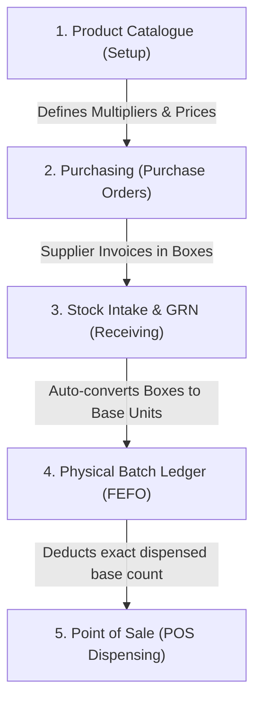

# GreenLifeAI: Packaging Units, Multipliers & Pricing Architecture Guide

This document provides a comprehensive operational and architectural guide on how **Unit Types**, **Packaging Tiers**, **Multipliers**, and **Pricing** work across the entire GreenLifeAI Pharmacy Management System: from **Product Catalogues** and **Purchasing (PO)**, to **Stock Intake (GRN)**, **Inventory Ledgers**, and the **Point of Sale (POS)**.

---

## 1. Architectural Philosophy: The "Golden Base Unit" Principle

In retail and clinical community pharmacy:
- **Distributors** invoice and supply in bulk outer cases or **Boxes**.
- **Prescribers** write orders in daily doses or blister **Strips**.
- **Patients** often buy full boxes, blister strips, or loose single **Tablets/Capsules** based on affordability or prescription length.

To eliminate inventory discrepancies and prevent mental arithmetic mistakes, GreenLifeAI adheres to a single foundational rule:

> **The internal inventory ledger always tracks stock in the atomic Base Unit (Tablet, Capsule, mL, Vial, Ampoule, Piece).**
> **Packaging tiers and multipliers are mathematical bridges that translate between bulk wholesale packaging and individual patient dispensing.**

```
┌─────────────────────────────────────────────────────────────────────────────┐
│                             PACKAGING HIERARCHY                             │
│                                                                             │
│   📦 Outer Box / Pack     ──► Multiplier = 100 (Contains 100 base units)     │
│          │                                                                  │
│          ▼                                                                  │
│   🪪 Strip / Blister      ──► Multiplier = 10  (Contains 10 base units)      │
│          │                                                                  │
│          ▼                                                                  │
│   💊 Base Unit (Piece)    ──► Multiplier = 1   (Smallest dispensable unit)  │
└─────────────────────────────────────────────────────────────────────────────┘
```

---

## 2. Practical Case Study: *Amoxil 500mg Capsules*

To illustrate how the system functions in daily operations, consider **Amoxil (Amoxicillin) 500mg**:

### Packaging & Pricing Configuration
- **Base Unit**: `Capsule` (Multiplier = 1)
- **Middle Tier**: `Strip of 10 Capsules` (Multiplier = 10)
- **Outer Box**: `Box of 10 Strips = 100 Capsules` (Multiplier = 100)

| Tier Level | Unit Name | Multiplier | Wholesale Cost | Retail Selling Price | Unit Margin | Total Value if 100% Sold at this Tier |
| :--- | :--- | :---: | :---: | :---: | :---: | :---: |
| **Outer Pack** | Box of 100 | **100** | GH₵ 80.00 / box | **GH₵ 120.00** / box | 33.3% | GH₵ 120.00 |
| **Middle Tier** | Strip of 10 | **10** | GH₵ 8.00 / strip | **GH₵ 14.00** / strip | 42.8% | GH₵ 140.00 (10 strips) |
| **Base Unit** | Single Capsule | **1** | GH₵ 0.80 / cap | **GH₵ 1.50** / cap | 46.7% | GH₵ 150.00 (100 capsules) |

> [!TIP]
> **Why Tiered Margins Matter:**
> Community pharmacies routinely earn higher profit margins when dispensing loose units (e.g. 5 capsules for GH₵ 7.50) to offset counting time and packaging supplies, while providing bulk discounts when a patient purchases a full, intact manufacturer box (GH₵ 120.00). GreenLifeAI supports both simultaneously.

---

## 3. Workflow Across All Modules



---

### Module 1: Product Master Catalogue (`CataloguePage.tsx`)
In the **Medications Master**, pharmacists configure the product once:
1. **Clinical Details**: Generic name (*Amoxicillin*), Brand (*Amoxil Forte*), Dosage Form (*Capsule*), Strength (*500mg*).
2. **Base Unit**: Set to `Capsule`.
3. **Packaging Tiers (Direct Pricing Master)**:
   - Enter **Pack Size**: `100`, Cost: `GH₵ 80.00`, Selling: `GH₵ 120.00`.
   - Enter **Strip Size**: `10`, Cost: `GH₵ 8.00`, Selling: `GH₵ 14.00`.
   - Enter **Base Loose Unit**: Cost: `GH₵ 0.80`, Selling: `GH₵ 1.50`.
   - *Alternative*: Click **⚡ Auto-Fill Loose from Box** to automatically compute pro-rated tablet costs and retail prices from the box definition.

---

### Module 2: Purchasing & Purchase Orders (`PurchasingPage.tsx`)
When requisitioning replenishment stock from pharmaceutical distributors:
- Suppliers quote and deliver in whole packs or cases.
- Staff creates a new Purchase Order and toggles **`Order Unit: [ 📦 Pack (100) ]`**.
- Staff enters **Order Qty: 50 Boxes** at **GH₵ 80.00/box**.
- **System calculations**:
  $$\text{Purchase Order Total} = 50\text{ Boxes} \times \text{GH₵ } 80.00 = \mathbf{\text{GH₵ } 4,000.00}$$
  $$\text{Incoming Base Ledger Units} = 50\text{ Boxes} \times 100 = \mathbf{5,000\text{ Capsules}}$$
- The purchase order document matches the supplier's commercial invoice perfectly.

---

### Module 3: Stock Intake & Goods Receipt Note (`InventoryPage.tsx` & GRN)
When the delivery driver arrives with the physical cartons:
1. The receiving officer opens the **Multi-Product Intake Workbench** or **Goods Receipt (GRN)** modal.
2. Selects the delivered medicine and toggles **`Intake Unit: [ 📦 Pack (100) ]`**.
3. Enters **50 Boxes** received at **GH₵ 80.00/box**.
4. **Automated Ledger Conversion**:
   - **Units Deposited**: The system automatically adds **5,000 Capsules** to the FEFO batch ledger.
   - **Valuation Cost**: Automatically recorded as **GH₵ 0.80 / capsule** ($\text{GH₵ } 80.00 \div 100$).
   - **Auto Batch Lot**: System generates an audit-traceable lot code (e.g. `AMO-20260921-742`).
   - **Zero Mental Math**: Staff never needs a desktop calculator to divide wholesale cartons into single tablets.

---

### Module 4: Inventory Ledger & FEFO Queue
Inside the database:
- Stock balances are strictly stored in base units:
  ```json
  {
    "productId": "prod_amox_500",
    "batchNumber": "LOT-20260921-742",
    "availableQuantity": 5000,
    "unitCost": 0.80,
    "expiryDate": "2028-06-30"
  }
  ```
- FEFO (First-Expiry, First-Out) sorts batches chronologically regardless of whether sales are made by box, strip, or loose capsule.

---

### Module 5: Point of Sale (POS Dispensing) (`PointOfSalePage.tsx`)
At the dispensary counter, cashiers handle diverse customer prescription requests:

#### Scenario A: Patient purchases 1 full sealed Box
- Cashier searches `Amoxil 500mg`.
- In the cart line, selects **Unit: `Box`** (Qty: 1).
- System charges: **GH₵ 120.00**.
- System deducts from inventory: $1 \times 100 = \mathbf{100\text{ Capsules}}$.

#### Scenario B: Patient presents a prescription for 2 Strips (20 capsules)
- Cashier searches `Amoxil 500mg`.
- In the cart line, selects **Unit: `Strip`** (Qty: 2).
- System charges: $2 \times \text{GH₵ } 14.00 = \mathbf{\text{GH₵ } 28.00}$.
- System deducts from inventory: $2 \times 10 = \mathbf{20\text{ Capsules}}$.

#### Scenario C: Patient requests 5 Loose Capsules
- Cashier searches `Amoxil 500mg`.
- In the cart line, selects **Unit: `Piece`** (Qty: 5).
- System charges: $5 \times \text{GH₵ } 1.50 = \mathbf{\text{GH₵ } 7.50}$.
- System deducts from inventory: $5 \times 1 = \mathbf{5\text{ Capsules}}$.

#### Stock Ledger Balance After All 3 Sales:
$$\text{Opening Stock: } 5,000\text{ Capsules}$$
$$\text{Dispensed: } 100\text{ (Box)} + 20\text{ (Strips)} + 5\text{ (Loose)} = 125\text{ Capsules}$$
$$\mathbf{\text{Closing Stock: } 4,875\text{ Capsules (equivalent to 48 Boxes, 7 Strips, 5 Loose Capsules)}}$$

---

## 4. Key Formulas & Conversions Reference

| Metric | Formula | Example (Amoxil Box of 100) |
| :--- | :--- | :--- |
| **Base Quantity from Packs** | $\text{Pack Qty} \times \text{Multiplier}$ | $50\text{ Boxes} \times 100 = 5,000\text{ capsules}$ |
| **Base Cost from Pack Cost** | $\text{Pack Cost} \div \text{Multiplier}$ | $\text{GH₵ } 80.00 \div 100 = \text{GH₵ } 0.80\text{ / capsule}$ |
| **Pack Markup (%)** | $\frac{\text{Selling} - \text{Cost}}{\text{Cost}} \times 100$ | $\frac{120 - 80}{80} \times 100 = 50.0\%$ |
| **Pack Gross Margin (%)** | $\frac{\text{Selling} - \text{Cost}}{\text{Selling}} \times 100$ | $\frac{120 - 80}{120} \times 100 = 33.3\%$ |
| **Loose Unit Markup (%)** | $\frac{\text{Selling} - \text{Cost}}{\text{Cost}} \times 100$ | $\frac{1.50 - 0.80}{0.80} \times 100 = 87.5\%$ |

---

## 5. Frequently Asked Questions (FAQ)

#### Q1: What happens if a medicine does not have strips (e.g. Paracetamol Syrup 100mL bottle)?
**Answer**: Set the **Base Unit** as `Bottle` with multiplier = 1. If purchased in cartons of 24 bottles, create an Outer Pack tier named `Carton` with multiplier = 24. Selling single bottles will deduct 1 bottle, while selling a carton will deduct 24 bottles.

#### Q2: What if a distributor changes their pack size from 100 to 80 tablets?
**Answer**: In the Stock Intake or Product Editor, update the pack multiplier to 80. Existing batches in inventory remain calibrated to their original received units, preserving financial valuation accuracy.

#### Q3: Does dispensing loose tablets create "broken box" inventory errors?
**Answer**: No. Because GreenLifeAI stores stock counts in base units, opening a box of 100 to sell 1 strip (10 tablets) leaves exactly 90 tablets in the ledger. The POS displays equivalent packaging availability (e.g. *"90 capsules available — 9 Strips or 90 Loose"*).

---

*Document Author: GreenLifeAI Core Engineering Team*  
*Last Updated: September 2026*  
*Version: 2.4.0 (Streamlined Packaging & Direct Tier Pricing)*
